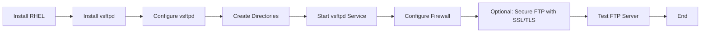

### **Project Title**: Deploying an FTP Server on Red Hat Enterprise Linux (RHEL)

----------



### **Objective**:

The objective of this project is to install and configure an **FTP (File Transfer Protocol)** server on 
**RHEL** using **vsftpd** (Very Secure FTP Daemon). The server will allow users to upload and download 
files securely within the network.

### **Project Overview**:

In this project, we will set up a secure FTP server on RHEL to allow users to access files remotely via 
the FTP protocol. We will configure the server to use basic authentication and provide anonymous access 
(optional). The project will cover:

1.  Installing **vsftpd**.
2.  Configuring the FTP server for local and anonymous access.
3.  Enabling **chroot** for user isolation.
4.  Securing the FTP server using **SSL/TLS** (optional).
5.  Configuring firewall rules to allow FTP traffic.


### **Project Steps**:

#### 1. **Preparation**

-   **RHEL Server**: A RHEL 8 or 9 machine.
-   **Network**: Ensure the server has a static IP.
-   **Privileges**: Root or sudo access.

#### 2. **Install vsftpd**

`vsftpd` is a secure and fast FTP server available in the RHEL repositories. Install it using the 
following command:

```bash
sudo yum install vsftpd -y
```
#### 3. **Configure vsftpd**

Edit the vsftpd configuration file:

```bash
sudo vi /etc/vsftpd/vsftpd.conf
```

Make the following changes to configure basic FTP access:

-   Allow local users to log in:
```bash
local_enable=YES
```

- Enable uploading files:
```bash
write_enable=YES
```

- Restrict users to their home directories (chroot):
```bash
chroot_local_user=YES
```

- Optional: Enable anonymous access (for read-only access):
```bash
anonymous_enable=YES
anon_upload_enable=NO
```
#### 4. **Create FTP Directories and Set Permissions**

If anonymous access is enabled, create the directories where anonymous users can upload/download files:

```bash
sudo mkdir -p /var/ftp/pub
sudo chown -R ftp:ftp /var/ftp
```

For local users, the default upload/download location will be their home directories.

#### 5. **Start and Enable the FTP Service**

After configuring `vsftpd`, start the service and enable it to start on boot:

```bash
sudo systemctl start vsftpd
sudo systemctl enable vsftpd
```

#### 6. **Configure Firewall**

Allow FTP traffic through the firewall:

```bash
sudo firewall-cmd --permanent --add-service=ftp
sudo firewall-cmd --reload
```

#### 7. **Secure FTP with SSL/TLS (Optional)**

To secure FTP communication using SSL/TLS, make sure OpenSSL is installed and generate SSL certificates:

```bash
sudo openssl req -x509 -nodes -days 365 -newkey rsa:2048 -keyout /etc/vsftpd/private/vsftpd.pem -out 
/etc/vsftpd/private/vsftpd.pem
```

Edit the `vsftpd.conf` file to include the following:

```bash
ssl_enable=YES
rsa_cert_file=/etc/vsftpd/private/vsftpd.pem
rsa_private_key_file=/etc/vsftpd/private/vsftpd.pem
```
Restart the vsftpd service:

```bash
sudo systemctl restart vsftpd
```

#### 8. **Testing FTP Server**

Test the FTP server by logging in with an FTP client or using the command line:

```bash
ftp <server_ip_address>
```

If SSL/TLS is enabled, use an FTP client that supports secure FTP (like FileZilla).

### **Benefits of This Project**:

-   **Secure File Transfers**: Enable secure file transfers across the network using SSL/TLS.
-   **User Isolation**: Each user will be restricted to their own home directory, enhancing security.
-   **Scalability**: The server can handle multiple users and support both anonymous and authenticated 
access.

### **Challenges**:

-   **Security**: FTP is an older protocol and inherently less secure than newer alternatives like SFTP.
-   **Configuration Complexity**: SSL/TLS setup for securing the FTP server can be complex and requires 
proper certificate management.

----------

### **Conclusion**:

By following this guide, you will have a fully functional FTP server capable of serving both authenticated 
users and anonymous clients. This server will be secure and reliable for internal file sharing needs.
